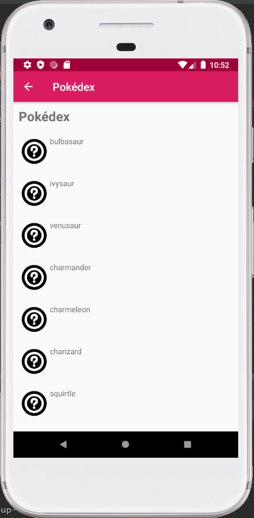
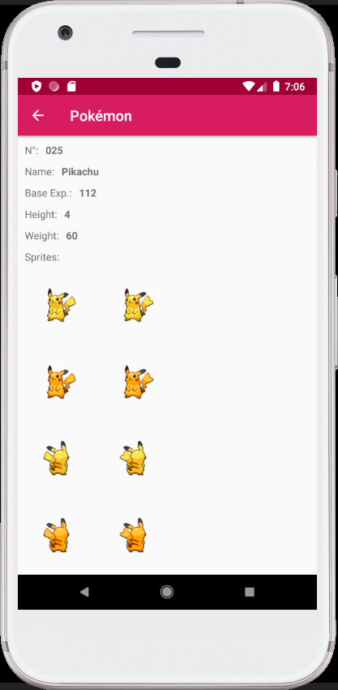

# PokéApp
An Android application displaying informations about Pokémon using the [PokéAPI](https://pokeapi.co/).

<kbd></kbd>

<kbd></kbd>

<kbd></kbd>

### Features
* **getPokedex()** - Retrieves a list of all Pokémon from PokéAPI (*Sprite*, *Number* and *Name*).
* **getPokemon()** - Shows all informations about a selected Pokémon (*Number*, *Name*, *Base Experience*, *Height*, *Weight* and *Sprites*).

### Miscellaneous
Documentation of *PokéAPI*: https://pokeapi.co/docs/v2.html/

### Licence
This project is licensed under the GPLv3 License. See the [LICENSE](LICENSE) file for details.
